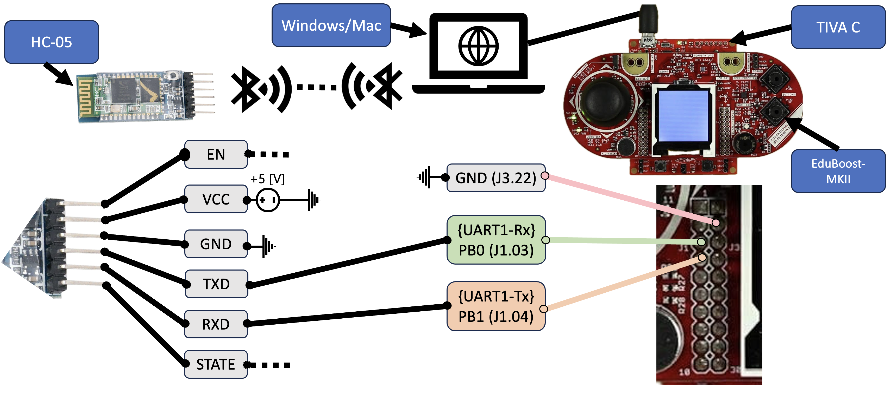

# MotionIoT: Vision & Bluetooth-Based Human Detection System



## Overview

MotionIoT is an end-to-end security system that couples a CNN-based vision pipeline on a host PC with a Tiva-C microcontroller running a custom RTOS. The system detects human presence using computer vision and provides real-time alerts through wireless communication.

### Key Features

- **Computer Vision Detection**: Uses YOLOv4-tiny to detect humans within 2m range
- **Wireless Communication**: Relays detection events over HC-05 Bluetooth (<100ms latency)
- **Multi-Modal Sensing**: Fuses vision and audio cues to reduce false alarms
- **Local Alerts**: Provides visual feedback via LCD and audible alerts via buzzer
- **Custom RTOS**: Demonstrates a home-grown cooperative RTOS with strict 1 kHz scheduling

## System Architecture

The project consists of two main components:

1. **Host PC** (Windows/Mac):
   - Running Python with OpenCV for computer vision
   - Processes webcam feed using YOLOv4-tiny CNN
   - Communicates detection events via Bluetooth

2. **Tiva-C Microcontroller**:
   - Running custom cooperative RTOS
   - Connected to EduBOOST-MKII peripherals (LCD, mic, buttons, buzzer)
   - Receives detection events via HC-05 Bluetooth module
   - Provides local alarm feedback

## Getting Started

### Prerequisites

#### Hardware Requirements
- Tiva-C TM4C123GXL development board
- EduBOOST-MKII BoosterPack
- HC-05 Bluetooth module
- Computer with webcam (Windows/Mac)

#### Software Requirements
- PC/Host:
  - Python 3.11 or newer
  - OpenCV 4.9
  - pyserial
- Embedded:
  - Keil µVision 5 (or other ARM development environment)
  - Segger J-Link (for programming)

### Hardware Setup

1. **Tiva-C and EduBOOST-MKII Connection**:
   - Mount the EduBOOST-MKII onto the Tiva-C LaunchPad
   
2. **HC-05 Bluetooth Connection**:
   - Connect the HC-05 module to the Tiva-C using UART1:
     - HC-05 VCC → 5V
     - HC-05 GND → GND
     - HC-05 TXD → Tiva PB0 (UART1 RX)
     - HC-05 RXD → Tiva PB1 (UART1 TX)

### Software Installation

1. **Clone the repository**:
   ```
   git clone https://github.com/jgaucin03/MotionIoT.git
   cd MotionIoT
   ```

2. **Set up Python environment**:
   ```
   cd pc
   pip install -r requirements.txt
   ```
   
   Note: If the requirements.txt file doesn't exist, you can create it with these dependencies:
   ```
   opencv-python>=4.9.0
   numpy>=1.23.0
   pyserial>=3.5
   pillow>=9.4.0
   ```

3. **Flash the Tiva-C**:
   - Open the `tm4c/motion_detector.c` project in Keil µVision
   - Build and flash to the Tiva-C board

### Running the System

1. **Pair your computer with the HC-05 module**:
   - Default pairing code is usually `1234`

2. **Launch the detection software**:
   ```
   cd pc
   python cv.py
   ```

3. **Following the on-screen prompts**:
   - Select your Bluetooth COM port
   - Select your webcam
   - Position the camera to monitor the desired area

4. **On the Tiva-C side**:
   - Press Button 1 to toggle between Camera and Microphone modes
   - Hold both buttons for 1s to arm/disarm the system

## System Operating Modes

- **Camera Mode**: Detects humans using computer vision (yellow alert)
- **Microphone Mode**: Detects sound above threshold (red alert)
- **Armed/Disarmed**: Controls whether alerts produce buzzer sounds

## Project Structure

```
MotionIoT/
├── README.md          # This file
├── dev/               # Development files (early testing and prototypes)
│   ├── currversion.c
│   ├── motion_detector_cvchirp.c
│   ├── motion_detector_cvchirpmic.c
│   ├── motion_detector_cvonly.c
│   └── motion_detector_miconly.c
├── docs/              # Documentation files
│   ├── images/        # Diagrams and screenshots
│   │   ├── communication_diagram.png
│   │   ├── hardware_diagram.png
│   │   └── sequence_diagram.png
│   ├── main.tex       # LaTeX source for report
│   ├── main.pdf       # Generated PDF report
│   └── presentation/  # Presentation slides
│       └── ECE5436_FinalProject.pdf
├── model/             # YOLOv4-tiny model files
├── pc/                # Python host computer code
│   ├── cv.py          # Main vision detection script
│   └── requirements.txt
├── test/              # Test utilities
│   ├── testBR.py      # Bluetooth rate tester
│   ├── testHC_05.py   # HC-05 module tester
│   └── testTM4CUART.c # UART test for Tiva
└── tm4c/              # Embedded code for Tiva-C
    ├── ECE_5436_Final_Project.zip # Project archive
    ├── motion_detector.c # Main embedded application
    ├── os.c           # Custom RTOS implementation
    └── os.h           # RTOS header
```

## Contributing

Contributions to MotionIoT are welcome! Here's how you can contribute:

1. **Fork the repository**
2. **Create a feature branch**:
   ```
   git checkout -b feature/your-feature-name
   ```
3. **Commit your changes**:
   ```
   git commit -am 'Add some feature'
   ```
4. **Push to the branch**:
   ```
   git push origin feature/your-feature-name
   ```
5. **Submit a pull request**

### Development Guidelines

- Follow the existing code style
- Add comments for any new functions
- Update documentation as needed
- Test on both Windows and Mac if possible
- Ensure detection latency remains under 100ms

## Development Notes

The `dev/` directory contains early iterations and proof-of-concept implementations:

- `currversion.c`: Stable implementation with full RTOS and peripheral support
- `motion_detector_cvchirp.c`: Computer vision detection with buzzer feedback
- `motion_detector_cvchirpmic.c`: Combined vision and microphone detection
- `motion_detector_cvonly.c`: Vision-only implementation (no sound sensing)
- `motion_detector_miconly.c`: Microphone-only implementation

These files document our development process and may be useful for understanding the evolution of the system.

## Future Work

- Integrate BLE or Wi-Fi for secure pairing and higher throughput
- Migrate CNN to an edge TPU or MCU-DSP to remove laptop dependency
- Implement pre-emptive priority scheduler for tighter audio timing
- Add support for multiple detection zones
- Implement cloud connectivity for remote notifications

## Performance

- End-to-end notification latency: 85±7 ms
  - YOLOv4-tiny: 55 ms
  - UART/Bluetooth: 30 ms
- Tested for continuous operation (30+ minutes with no buffer overruns)

## License

This project is licensed under the MIT License - see the [LICENSE](LICENSE) file for details.

## Acknowledgments

- Built upon TM4C123GXL and EduBOOST-MKII platforms
- Uses AlexeyAB's YOLOv4-tiny implementation
- Developed as part of ECE 5436/6336 course

## Contact

- **Luke Dvorak** - [Email](ljdvorak@cougarnet.uh.edu)
- **Jonathan Gaucin** - [GitHub Profile](https://github.com/jgaucin03)

Project Link: [https://github.com/jgaucin03/MotionIoT](https://github.com/jgaucin03/MotionIoT)
